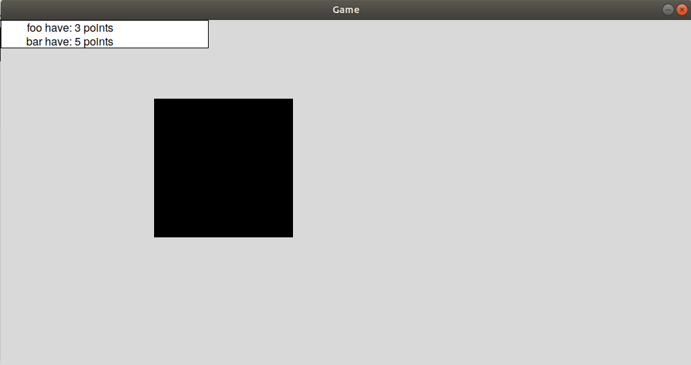

# reactionGame 
Simple reaction game. The player who clicks on the figure first gets the point.

## Built in Python.
- To run the server type: python server.py <yourip>
- To run the client type: python gameWSiri.py
  
  
